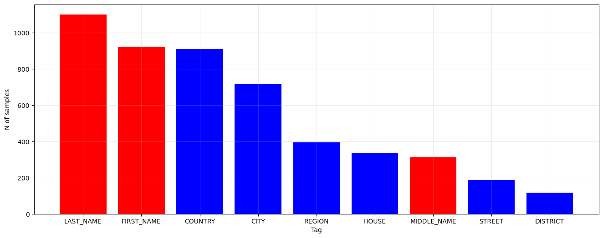
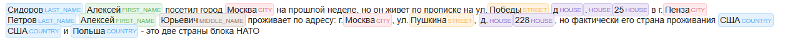

# Detailed NER Dataset RU

In this repository you can find small detailed labeled Russian NER dataset for training model for NER task or for 
add it for your training dataset.

## Dataset description
Dataset was collected and labeled by hands and using ChatGPT generation with labeling on Russian language.

Dataset is labeled in *BIOLU* format, where:
* **B** - beginning token
* **I** - inner token
* **O** - other token
* **L** - last token
* **U** - unite token

Here are samples from dataset:
```Python
['ОАО', '"СТАВРОПОЛЬЭНЕРГОБАНК"', 'В', 'ЧЕРКЕССКЕ'] ['O', 'O', 'O', 'U-CITY']
['Сталепромышленная', 'компания'] ['O', 'O']
['Сулейманов', ',', 'Манаф', 'Фарадж', 'оглы'] ['U-LAST_NAME', 'O', 'U-FIRST_NAME', 'B-MIDDLE_NAME', 'L-MIDDLE_NAME']
```

Dataset labeled (contained) following tags:
* **LOC** tags:
    * **COUNTRY**
    * **REGION**
    * **CITY**
    * **DISTRICT**
    * **STREET**
    * **HOUSE**
* **PER** tags:
    * **LAST_NAME**
    * **FIRST_NAME**
    * **MIDDLE_NAME**

The dataset size is:
```Python
train_df.shape
>>> (7532, 2)
```

Below are the distribution of tags in the dataset as a percentage:

| *Tag*           | *Amount (% / 100)* |
|:----------------|:-------------------|
| **LAST_NAME**   | 0.22               |
| **FIRST_NAME**  | 0.184              |
| **COUNTRY**     | 0.182              |
| **CITY**        | 0.144              |
| **REGION**      | 0.079              |
| **HOUSE**       | 0.068              |
| **MIDDLE_NAME** | 0.062              |
| **STREET**      | 0.037              |
| **DISTRICT**    | 0.023              |





## Utils (relabeling)
Also, in repository you will find utils for relabeling tags. There are 4 function for it.

* `biolu2bio` - convert tags from *BIOLU* format to *BIO*
* `biolu2single_token` - convert tags from *BIOLU* format to single-token format ('U-CITY' --> 'CITY') 
* `detailed2default` - convert current tags to tag list: LOC, PER
* `detailed2custom` - convert current tags to predefined custom tag list.

For more details how to use these functions check test.

## Demo
If you want use dataset in your code just follow steps:

Clone rep:

`git clone https://github.com/AlexKly/Detailed-NER-Dataset-RU.git`

Specify path to pickle file and load it using **Pandas**:

```Python
import pandas as pd

path_ds = '../Detailed-NER-Dataset-RU/dataset/detailed-ner_dataset-ru.pickle'
train_df = pd.read_pickle(path_ds)
```

Here you can find notebook how to use dataset and results after training NER model on detailed-ner-dataset-ru: 
[Google Collab Notebook](https://colab.research.google.com/drive/1_60NwT_LwaZ3od3RLflAx13yztQGdG-R?usp=sharing).

It was chosen pre-trained *'wikineural-multilingual-ner'* model and we've trained on *'detailed-ner-dataset-ru'*. Below 
are report and results after training:

| Epoch  | Training Loss | Validation Loss | Precision | Recall   | F1       | Accuracy |
|:-------|:--------------|:----------------|:----------|:---------|:---------|:---------|
| **1**  | No log        | 0.165882        | 0.707182  | 0.712430 | 0.709797 | 0.957667 |
| **2**  | 0.295800      | 0.107805        | 0.798548  | 0.816327 | 0.807339 | 0.971415 |
| **3**  | 0.099600      | 0.089499        | 0.807487  | 0.840445 | 0.823636 | 0.977472 |
| **4**  | 0.050600      | 0.081117        | 0.821306  | 0.886827 | 0.852810 | 0.981828 |
| **5**  | 0.050600      | 0.098756        | 0.796327  | 0.884972 | 0.838313 | 0.975430 |
| **6**  | 0.025100      | 0.082220        | 0.835106  | 0.873840 | 0.854034 | 0.981556 |
| **7**  | 0.015900      | 0.098189        | 0.814626  | 0.888683 | 0.850044 | 0.978833 |
| **8**  | 0.009700      | 0.082318        | 0.865108  | 0.892393 | 0.878539 | 0.983666 |
| **9**  | 0.009700      | 0.090862        | 0.806397  | 0.888683 | 0.845543 | 0.979446 |
| **10** | 0.006500      | 0.083708        | 0.863309  | 0.890538 | 0.876712 | 0.983462 |

## Results (token classification):
As a result, it quite enough size of dataset for training NER-model for quite good results training model on 10 epochs 
using pre-trained model **Wikineural-Multilingual-NER**: we've got after training the following best metrics:
* **epoch 8**: *Precision* ***-->*** 0.865108, *Recall* ***-->*** 0.892393, *F1-score* ***-->*** 0.878539, *Accuracy* 
***-->*** 0.983666


